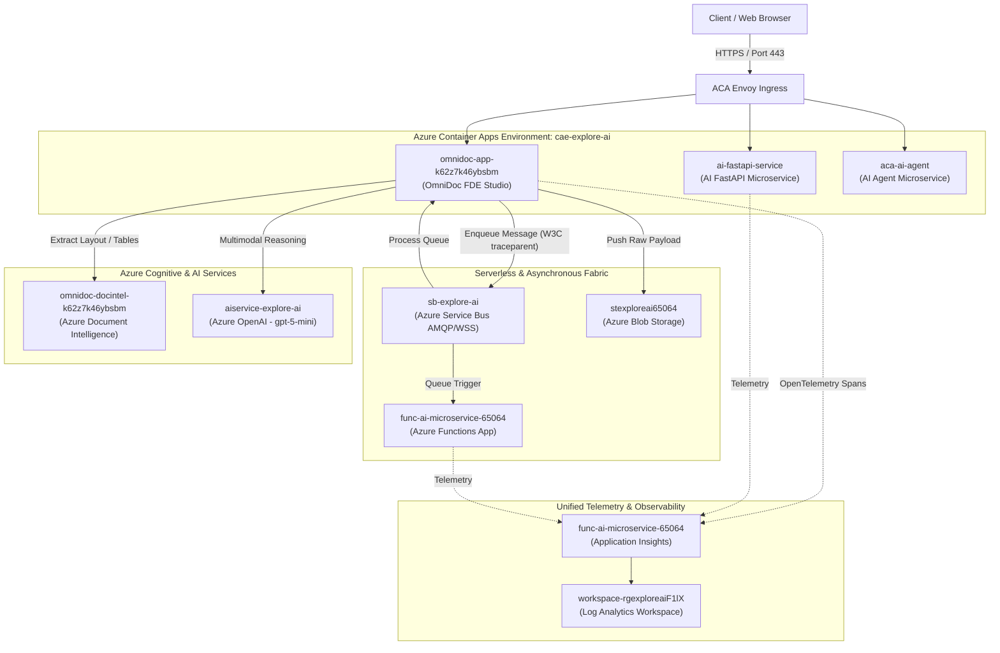

# Azure Microservices Performance, Paths & Observability Directory

**Target Cloud Environment:** Microsoft Azure  
**Resource Group:** `rg-explore-ai`  
**Subscription ID:** `6fb67c72-73dc-4767-a210-0ea6b6c99feb`  
**Primary Region:** `East US`  
**Application Insights Component:** `func-ai-microservice-65064`  
**Log Analytics Workspace:** `workspace-rgexploreaiF1lX`  

---

## 1. Executive Summary

This document provides a directory of all microservices, serverless workloads, message brokers, AI cognitive services, and observability infrastructure provisioned in the `rg-explore-ai` resource group. It details their public endpoints, API routes, operational roles, and exact Azure Portal paths for monitoring real-time performance, latency percentiles (P50, P95, P99), and distributed OpenTelemetry traces.



---

## 2. Curated Microservices Directory & Public Endpoints

### 2.1. OmniDoc Enterprise FDE Studio
* **Resource Name:** `omnidoc-app-k62z7k46ybsbm`
* **Resource Type:** `Microsoft.App/containerApps`
* **Managed Environment:** `cae-explore-ai`
* **Base Public URL:** `https://omnidoc-app-k62z7k46ybsbm.yellowwater-c3bd8780.eastus.azurecontainerapps.io`
* **Primary API & Health Paths:**
  * **Interactive Web Studio UI:** `GET /`
  * **Microservice Health Check:** `GET /api/v1/health`
  * **Interactive Swagger UI:** `GET /docs`
  * **OpenAPI Schema (JSON):** `GET /openapi.json`
  * **ReDoc Documentation:** `GET /redoc`
  * **Asynchronous Service Bus Ingestion:** `POST /api/v1/jobs/submit`
  * **Job Status Query:** `GET /api/v1/jobs/{job_id}/status`
  * **Real-time SSE Live Progress Stream:** `GET /api/v1/jobs/{job_id}/stream`
  * **Recent Batch Jobs Query:** `GET /api/v1/jobs/recent`
  * **Direct Synchronous Analysis:** `POST /api/v1/process`
  * **Interactive Multi-Turn Document Chat:** `POST /api/v1/chat`

---

### 2.2. AI FastAPI Microservice
* **Resource Name:** `ai-fastapi-service`
* **Resource Type:** `Microsoft.App/containerApps`
* **Base Public URL:** `https://ai-fastapi-service.yellowwater-c3bd8780.eastus.azurecontainerapps.io`
* **Primary API & Health Paths:**
  * **Interactive Swagger UI:** `GET /docs`
  * **ReDoc Documentation:** `GET /redoc`
  * **OpenAPI Schema:** `GET /openapi.json`
  * **Service Health Check:** `GET /health` or `GET /`

---

### 2.3. ACA AI Agent Microservice
* **Resource Name:** `aca-ai-agent`
* **Resource Type:** `Microsoft.App/containerApps`
* **Base Public URL:** `https://aca-ai-agent.yellowwater-c3bd8780.eastus.azurecontainerapps.io`
* **Primary API & Health Paths:**
  * **Root / Status:** `GET /`
  * **Agent Execution Endpoints:** `POST /api/agent/run` or `GET /docs`

---

### 2.4. Serverless Function Microservice
* **Resource Name:** `func-ai-microservice-65064`
* **Resource Type:** `Microsoft.Web/sites` (Azure Functions on Linux Plan `EastUSLinuxDynamicPlan`)
* **Production Base URL:** `https://func-ai-microservice-65064.azurewebsites.net`
* **Staging Slot URL:** `https://func-ai-microservice-65064-staging.azurewebsites.net`
* **Operational Role:** Handles serverless event triggers, background queue processing, and scheduled orchestration tasks.

---

### 2.5. Message Broker & Storage Layer
| Service Name | Resource Type | Target / Namespace | Purpose & Monitored Queues |
| :--- | :--- | :--- | :--- |
| **`sb-explore-ai`** | `Microsoft.ServiceBus/namespaces` | `sb-explore-ai.servicebus.windows.net` | Enterprise AMQP message broker.<br>• **Queue:** `ai-jobs-queue` (Payload references & metadata)<br>• **Queue:** `ai-results-queue` (Analysis outputs)<br>• **DLQ:** `ai-jobs-queue/$deadletterqueue` (Poison message quarantine) |
| **`stexploreai65064`** | `Microsoft.Storage/storageAccounts` | `https://stexploreai65064.blob.core.windows.net` | Primary enterprise document payload store.<br>• **Container:** `raw-documents` (Ingested PDF/Images with SAS tokens)<br>• **Container:** `results` (Persisted JSON payloads) |
| **`stgdocintelk62z7k46`** | `Microsoft.Storage/storageAccounts` | `https://stgdocintelk62z7k46.blob.core.windows.net` | Dedicated storage account for Document Intelligence OCR training data and caches. |

---

### 2.6. Cognitive & AI Services
| Service Name | Resource Type | Endpoint | Capabilities |
| :--- | :--- | :--- | :--- |
| **`omnidoc-docintel-k62z7k46ybsbm`** | `Microsoft.CognitiveServices/accounts` | `https://omnidoc-docintel-k62z7k46ybsbm.cognitiveservices.azure.com/` | Prebuilt Layout 2024-11-30 OCR, key-value extraction, table structure identification, and reading order normalization. |
| **`aiservice-explore-ai`** | `Microsoft.CognitiveServices/accounts` | `https://aiservice-explore-ai.openai.azure.com/` | Multimodal Vision & Reasoning using deployed model `gpt-5-mini` (temperature 0.1, structured schema outputs). |

---

## 3. Azure Portal Paths for Performance & Tracing

All microservices emit OpenTelemetry telemetry directly into **Application Insights: `func-ai-microservice-65064`**.

### 3.1. Live Metrics (<1 Second Latency)
* **Portal Navigation Path:**  
  `Azure Portal` ➔ `Resource Groups` ➔ `rg-explore-ai` ➔ `func-ai-microservice-65064` *(Type: Application Insights)* ➔ **`Investigate > Live Metrics`**
* **Monitored Indicators:**
  * **Incoming Request Rate (Req/Sec)** across all active ACA replicas.
  * **Average Request Duration (ms)** in real time.
  * **Overall Failure Rate (%)**.
  * **Live Process Physical CPU & Memory Working Set** consumption.
  * **Real-time Sampled Logs & Exception Tracebacks**.

---

### 3.2. End-to-End Application Map (Dependency Topology)
* **Portal Navigation Path:**  
  `func-ai-microservice-65064` ➔ **`Investigate > Application Map`**
* **Capabilities:**
  * Displays interactive nodes representing `omnidoc-app`, `Azure Service Bus`, `Blob Storage`, `Document Intelligence`, and `Azure OpenAI`.
  * Highlights latency bottlenecks with color-coded warning rings (green for normal, red for degraded/failing).
  * Clicking on any dependency link exposes the average response time and failure counts for that specific inter-service hop.

---

### 3.3. Response Time Percentiles (P50, P95, P99)
* **Portal Navigation Path:**  
  `func-ai-microservice-65064` ➔ **`Investigate > Performance`**
* **Capabilities:**
  * Group operations by endpoint (e.g., `/api/v1/jobs/submit` vs `/api/v1/process`).
  * View percentile distributions (50th, 95th, 99th percentile response times).
  * Identify slow dependencies (e.g., Azure OpenAI completion time vs Document Intelligence layout extraction time).
  * Single-click drill-down into individual slow transaction traces.

---

### 3.4. Exceptions & Failure Diagnosis
* **Portal Navigation Path:**  
  `func-ai-microservice-65064` ➔ **`Investigate > Failures`**
* **Capabilities:**
  * Categorizes failures by HTTP response code (500 internal errors, 429 rate limit errors from OpenAI).
  * Pinpoints exact unhandled Python exceptions, filenames, and line numbers.
  * Filter by Dependency Failures vs Server Failures.

---

### 3.5. Container Apps Metrics & Autoscaling (KEDA)
* **Portal Navigation Path:**  
  `Resource Groups` ➔ `rg-explore-ai` ➔ `omnidoc-app-k62z7k46ybsbm` ➔ **`Monitoring > Metrics`**
* **Key Metrics to Track:**
  * `Requests`: Total ingress traffic processed by Envoy.
  * `Response Time`: Ingress round-trip latency.
  * `Replica Count`: Active running container instances (configured to scale dynamically between 1 and 10 based on HTTP concurrency).
  * `CPU Usage` & `Memory Working Set Bytes`.

---

## 4. Production Kusto Query Language (KQL) Queries

Use these queries in **`func-ai-microservice-65064 > Monitoring > Logs`** or **`workspace-rgexploreaiF1lX > Logs`** to analyze microservices performance.

### 4.1. Response Time Percentiles & Request Volume by Microservice
```kusto
requests
| where timestamp > ago(1h)
| summarize 
    TotalRequests = count(),
    AvgDurationMs = round(avg(duration), 2),
    P50_Ms = round(percentile(duration, 50), 2),
    P95_Ms = round(percentile(duration, 95), 2),
    P99_Ms = round(percentile(duration, 99), 2),
    FailureCount = countif(success == false),
    FailureRate = round(100.0 * countif(success == false) / count(), 2)
  by cloud_RoleName, name
| order by TotalRequests desc
```

---

### 4.2. Downstream Dependency Bottleneck Breakdown
```kusto
dependencies
| where timestamp > ago(1h)
| summarize 
    TotalCalls = count(),
    AvgDurationMs = round(avg(duration), 2),
    P95_Ms = round(percentile(duration, 95), 2),
    Failures = countif(success == false),
    FailureRate = round(100.0 * countif(success == false) / count(), 2)
  by target, type, name
| order by AvgDurationMs desc
```

---

### 4.3. Asynchronous Job Processing & Queue Ingestion Times
```kusto
customEvents
| where timestamp > ago(4h)
| where name in ("ai_job_queued", "ai_job_completed", "ai_job_failed")
| project 
    timestamp, 
    Event = name, 
    JobId = tostring(customDimensions["job_id"]), 
    DocType = tostring(customDimensions["doc_type"]), 
    DurationSec = todouble(customDimensions["duration_sec"]),
    CustomProps = customDimensions
| order by timestamp desc
```

---

### 4.4. Top Failing Operations & Correlation Trace IDs
```kusto
requests
| where timestamp > ago(2h) and success == false
| project 
    timestamp, 
    Microservice = cloud_RoleName, 
    Operation = name, 
    HttpCode = resultCode, 
    DurationMs = duration, 
    TraceId = operation_Id, 
    RequestId = id
| order by timestamp desc
| take 50
```

---

### 4.5. End-to-End Distributed Trace Inspection by Trace ID
```kusto
let targetTrace = "<PASTE_OPERATION_ID_HERE>";
union 
    (requests | where operation_Id == targetTrace | project timestamp, Role = cloud_RoleName, ItemType = "Request", Name = name, DurationMs = duration, Success = success, Details = resultCode),
    (dependencies | where operation_Id == targetTrace | project timestamp, Role = cloud_RoleName, ItemType = "Dependency", Name = name, DurationMs = duration, Success = success, Details = target),
    (exceptions | where operation_Id == targetTrace | project timestamp, Role = cloud_RoleName, ItemType = "Exception", Name = type, DurationMs = 0.0, Success = false, Details = outerMessage)
| order by timestamp asc
```

---

## 5. Microservices Operational SLA & Scaling Matrix

| Tier | Component | Scale Rule (KEDA) | Target SLA Latency | Action on Spike |
| :--- | :--- | :--- | :--- | :--- |
| **Frontend / Ingress** | ACA Envoy & FastAPI Web App | Concurrent HTTP Requests > 10 | < 200 ms (Async Submit) | Scales out up to 10 container replicas |
| **Queue Ingestion** | Azure Service Bus Queue | Active Messages > 5 per replica | < 50 ms AMQP Push | KEDA provisions additional background worker replicas |
| **OCR Extraction** | Document Intelligence S0 | Managed Tier Throttling | 2.5s – 5.5s per document page | Client retries with exponential backoff on HTTP 429 |
| **Multimodal Vision** | Azure OpenAI `gpt-5-mini` | Token TPM / RPM Quota | 1.8s – 4.0s per extraction | Parallel chunking & retry with jitter |
| **Storage Persist** | Azure Blob Storage Hot Tier | Read/Write IOPS | < 150 ms per 5MB document | Direct-to-blob SAS upload bypassing app compute |
