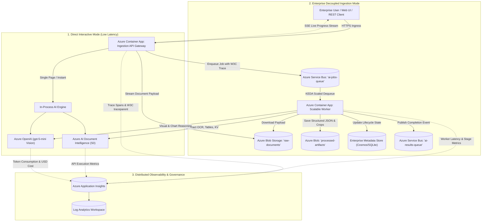

# OmniDoc AI - Azure Forward Deployed Engineering (FDE) Enterprise Architecture Guide

## 1. Executive Summary

This architecture guide specifies the enterprise production design for the **OmniDoc AI Multimodal Document Intelligence & Vision Studio**. Transitioning from a single-tier prototype to an enterprise **Forward Deployed Engineering (FDE)** solution, the platform decouples interactive HTTP traffic from heavy computational AI inference using **Azure Service Bus**, stores immutable document artifacts in **Azure Blob Storage**, instruments distributed W3C tracing across all microservices via **OpenTelemetry & Azure Application Insights**, and scales autonomously via **KEDA (Kubernetes Event-driven Autoscaling)** in **Azure Container Apps**.

---

## 2. Cloud Architecture Diagram



---

## 3. Core Enterprise Components

| Component | Azure Resource | Resource Group | Purpose |
| :--- | :--- | :--- | :--- |
| **API Gateway & Ingestion** | Azure Container App (`omnidoc-fde-app`) | `rg-explore-ai` | Public HTTPS ingress, file validation, SAS token generation, SSE streaming |
| **Message Broker / Queue** | Azure Service Bus (`sb-explore-ai`) | `rg-explore-ai` | Decoupled load buffering (`ai-jobs-queue`), DLQ triage, event notification (`ai-results-queue`) |
| **Blob Storage** | Azure Storage Account (`stexploreai65064`) | `rg-explore-ai` | Immutable raw document storage (`raw-documents`) and processed output artifacts |
| **Document Intelligence** | Azure AI Services (`omnidoc-docintel-k62z7k46ybsbm`) | `rg-explore-ai` | Layout extraction, tables, key-value pairs, reading order OCR |
| **Multimodal Vision AI** | Azure OpenAI (`aiservice-shipment-poc`) | `rg-shipment-automation-poc` | Model `gpt-5-mini` deep reasoning on charts, flowcharts, and complex diagrams |
| **Observability & Tracing** | Application Insights (`func-ai-microservice-65064`) | `rg-explore-ai` | OpenTelemetry distributed tracing, p50/p95 latency, token tracking, custom metrics |
| **Container Environment** | Managed Environment (`cae-explore-ai`) | `rg-explore-ai` | Serverless container hosting with KEDA autoscaling |

---

## 4. Dual Ingestion Paradigms

### A. Direct Interactive Mode (Sub-second exploration)
- **Endpoint**: `POST /api/v1/documents/upload`
- **Use Case**: Single-page document exploration, developer testing, and instant visual verification in the UI.
- **Workflow**: Direct HTTP multipart upload $\rightarrow$ in-memory buffer processing $\rightarrow$ Document Intelligence $\rightarrow$ OpenAI Vision $\rightarrow$ synchronous JSON response.

### B. Enterprise Asynchronous Service Bus Mode (Batch & High Throughput)
- **Endpoint**: `POST /api/v1/jobs/submit` (returns `HTTP 202 Accepted` with `job_id`)
- **Use Case**: Multi-page documents, large TIFF/PDF files, burst load buffering, enterprise upstream system integrations.
- **Workflow**:
  1. Stream file directly to Azure Blob Storage `raw-documents/{job_id}/{filename}`.
  2. Create state record in Job Store (`status="QUEUED"`).
  3. Publish AMQP message over WebSocket (port 443) into Service Bus `ai-jobs-queue` with W3C `traceparent`.
  4. Client subscribes to real-time Server-Sent Events (`GET /api/v1/jobs/{job_id}/stream`) to receive live stage transitions:
     - `QUEUED_IN_SERVICE_BUS` (5%)
     - `FETCHING_FROM_AZURE_BLOB` (20%)
     - `AZURE_DOCUMENT_INTELLIGENCE_OCR` (50%)
     - `AZURE_OPENAI_VISION_ANALYSIS` (85%)
     - `PERSISTING_STRUCTURED_DATA` (95%)
     - `PROCESSING_COMPLETED` (100%)
  5. Finished document result retrieved via `GET /api/v1/jobs/{job_id}/result`.

---

## 5. Distributed Tracing & OpenTelemetry Specification

Distributed tracing links client requests across all microservices and Azure AI services using the standard W3C `traceparent` format: `00-{trace_id}-{span_id}-01`.

### Custom Dimensions Logged to Application Insights:
- `document_id`: Unique identifier for the document
- `job_id`: Correlation ID matching Service Bus message
- `file_name` & `file_size_bytes`: Ingested file metadata
- `total_pages` & `total_elements`: Complexity metrics
- `prompt_tokens`, `completion_tokens`, `total_tokens`: LLM consumption
- `estimated_cost_usd`: Real-time cost computation based on Azure pricing tiers
- `duration_ms`: Duration of individual pipeline stages

### Useful KQL Queries for Azure Monitor:
```kql
// Query End-to-End Processing Latency
dependencies
| where name in ("azure.doc_intel.layout", "azure.openai.vision", "azure.blob.upload")
| summarize AvgDurationMs = avg(duration), P95DurationMs = percentile(duration, 95) by name

// Query Daily Token Consumption and Estimated Cost
customEvents
| where name == "DocumentAnalysisCompleted"
| extend Tokens = toint(customDimensions.total_tokens), Cost = todouble(customDimensions.estimated_cost_usd)
| summarize TotalTokens = sum(Tokens), TotalCostUSD = sum(Cost) by bin(timestamp, 1d)
```

---

## 6. KEDA Autoscaling Policies

Azure Container Apps scales worker replicas dynamically based on Azure Service Bus queue depth:

```yaml
scale:
  minReplicas: 1
  maxReplicas: 5
  rules:
    - name: keda-servicebus-queue-rule
      custom:
        type: azure-servicebus
        metadata:
          queueName: ai-jobs-queue
          messageCount: '5' # Scale up 1 replica per 5 queued messages
```

---

## 7. Security, Identity & RBAC Matrix

- **Zero Hardcoded Secrets**: Production deployments utilize Azure Managed Identities (`SystemAssigned`).
- **RBAC Role Assignments**:
  - `Azure Service Bus Data Receiver`: Assigned to worker container identity.
  - `Azure Service Bus Data Sender`: Assigned to API gateway identity.
  - `Storage Blob Data Contributor`: Granted access to upload and read document blobs.
  - `Cognitive Services User`: Granted access to call Document Intelligence and OpenAI without static API keys.
- **Firewall Traversal**: Uses `TransportType.AmqpOverWebsocket` to route AMQP traffic securely over standard HTTPS (port 443), avoiding blocked corporate ports 5671/5672.

---

## 8. Deployment Runbook

### Prerequisites
- Azure CLI (`az`) authenticated to the target subscription.
- Active subscription: `6fb67c72-73dc-4767-a210-0ea6b6c99feb`.

### Automated Production Deployment
Run the automated deployment script:
```powershell
.\deploy_fde_azure.ps1 -ResourceGroupName "rg-explore-ai" -AcrName "acrexploreai65064"
```

### Verification
1. Health Check: `GET https://<fqdn>/api/v1/health`
2. Swagger Documentation: `GET https://<fqdn>/docs`
3. Web Studio Interface: `GET https://<fqdn>/`
