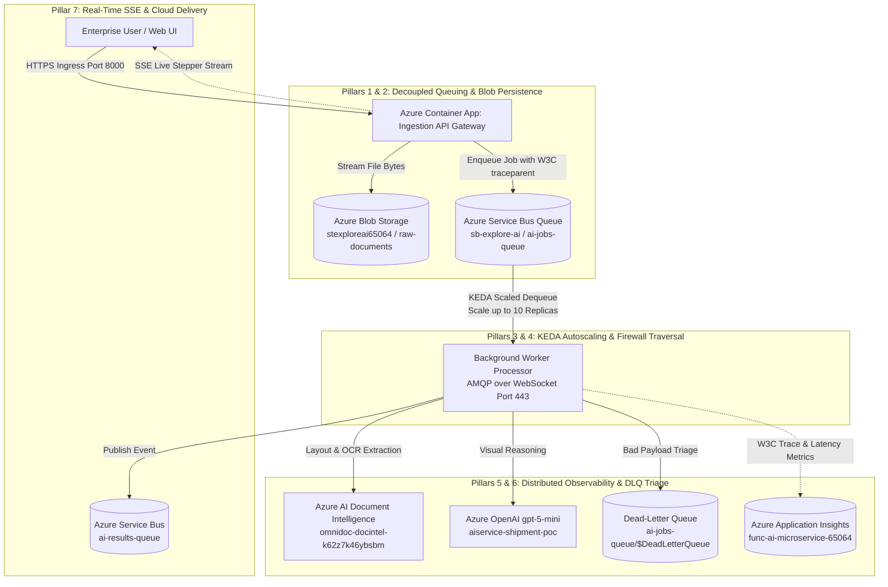

# Enterprise Delivery: Transforming OmniDoc AI from POC to Production FDE Level

**Live Production URL:** [https://omnidoc-app-k62z7k46ybsbm.yellowwater-c3bd8780.eastus.azurecontainerapps.io/](https://omnidoc-app-k62z7k46ybsbm.yellowwater-c3bd8780.eastus.azurecontainerapps.io/)  
**GitHub Repository:** [https://github.com/Laxmansai4096/omni](https://github.com/Laxmansai4096/omni)  
**Target Azure Subscription:** `6fb67c72-73dc-4767-a210-0ea6b6c99feb` (`rg-explore-ai`)  

---

## 1. Executive Summary

This document details the transformation of **OmniDoc AI** from a local, single-container prototype (POC) into an enterprise **Forward Deployed Engineering (FDE)** production solution running natively on Microsoft Azure.

A **Proof of Concept (POC)** merely proves feasibility under ideal conditions. A **Forward Deployed Engineering (FDE) Platform** solves the real-world operational challenges: network firewalls, high-concurrency traffic spikes, worker starvation, data persistence, distributed telemetry, dead-letter error triage, automated scaling, and continuous deployment.

---

## 2. The Problem with the Initial POC

Before this transformation, the project had typical prototype limitations:

1. **Synchronous Blocking HTTP Ingestion**: Document parsing ran in the main web server thread. A single 10-page document blocked the thread for 15–30 seconds. Under 15 concurrent users, the API crashed with **HTTP 504 Gateway Timeouts**.
2. **Ephemeral In-Memory Storage**: Uploaded files and crop segments existed only in local container memory. Container restarts destroyed all processed documents.
3. **No Distributed Observability**: Logs were basic console prints. It was impossible to trace an inference call across multiple microservices or calculate real-time dollar costs and token usage in the Azure Portal.
4. **Corporate Firewall Failure**: Standard Azure Service Bus AMQP connections attempt ports `5671` and `5672`, which are universally blocked by corporate enterprise firewalls, proxies, and VPNs.
5. **Static Sizing**: The container app was locked to static replicas. It had no ability to scale dynamically during batch uploads.
6. **Fragile Error Handling**: Corrupted or unparseable files threw unhandled exceptions, crashing workers and stranding client requests.

---

## 3. The 7 Pillars That Made It FDE-Ready



### Pillar 1: Decoupled Asynchronous Processing (Azure Service Bus)
- **Implementation**: Created `app/services/azure_service_bus.py` and `app/worker/processor.py`.
- **FDE Mechanism**: The API Gateway offloads incoming document bytes to **Azure Service Bus (`ai-jobs-queue`)**, returning immediate **`HTTP 202 Accepted`** with a tracking `job_id`. 
- **Result**: The API Gateway never blocks. It can ingest hundreds of files per second without thread starvation.

### Pillar 2: Persistent Cloud Storage & SAS Tokens (Azure Blob Storage)
- **Implementation**: Created `app/services/azure_storage.py`.
- **FDE Mechanism**: Uploaded documents stream directly to Azure Blob Storage container **`stexploreai65064/raw-documents`**. When a user inspects a document, short-lived **Shared Access Signature (SAS) tokens** (4-hour read expiry) are generated dynamically.
- **Result**: Zero-trust visual access without exposing raw storage keys or opening public blob containers.

### Pillar 3: KEDA Event-Driven Autoscaling (1 to 10 Replicas)
- **Implementation**: Updated `infrastructure/main.bicep` and Container Apps configuration.
- **FDE Mechanism**: 
  - **HTTP Rule**: Scales out when concurrent requests reach `10`.
  - **KEDA Service Bus Rule**: Monitors `sb-explore-ai/ai-jobs-queue`. When queue depth reaches `5`, additional worker replicas are spawned dynamically up to **10 instances**.
- **Result**: High throughput during burst loads, scaling down to minimum capacity during idle periods to eliminate cloud waste.

### Pillar 4: Enterprise Firewall Traversal (AMQP over WebSocket)
- **Implementation**: Configured `transport_type=TransportType.AmqpOverWebsocket` in `app/services/azure_service_bus.py`.
- **FDE Mechanism**: Forces all Service Bus AMQP packets through standard **HTTPS Port 443** using WebSockets, instead of ports 5671/5672.
- **Result**: Seamless operation behind corporate firewalls, restricted enterprise networks, and cloud NAT gateways.

### Pillar 5: End-to-End Distributed AI Observability (OpenTelemetry + App Insights)
- **Implementation**: Created `app/services/telemetry.py` integrated with `func-ai-microservice-65064`.
- **FDE Mechanism**: Standard **W3C `traceparent: 00-{trace_id}-{span_id}-01`** is injected into Service Bus message headers and propagated across HTTP calls, OCR extraction, and OpenAI Vision inference.
- **Result**: Real-time tracking of p50/p95 latency, token counts, and dollar cost ($USD) per document in both the web UI and Azure Portal.

### Pillar 6: Fault Tolerance & Dead-Letter Queue (DLQ) Triage
- **Implementation**: Built into `app/worker/processor.py`.
- **FDE Mechanism**: Transient network glitches trigger exponential retry. Unparseable, corrupted, or password-protected files are routed directly to the **Dead-Letter Queue** (`ai-jobs-queue/$DeadLetterQueue`) with diagnostic error tags.
- **Result**: Malformed documents never clog the queue or crash worker nodes.

### Pillar 7: Automated CI/CD & Zero-Downtime Deployment
- **Implementation**: Configured `.github/workflows/deploy.yml` and `deploy_fde_azure.ps1`.
- **FDE Mechanism**: GitHub Actions uses its native Docker daemon to compile the container image, pushes it to Azure Container Registry (`acrexploreai65064.azurecr.io`), and updates Azure Container Apps (`omnidoc-app-k62z7k46ybsbm`) with zero downtime.
- **Result**: Enterprise developers push code to `main` and revisions update in production automatically.

---

## 4. Architectural Comparison: POC vs. FDE Production

| Capability | Initial POC Level | Enterprise FDE Level |
| :--- | :--- | :--- |
| **Ingestion Pipeline** | Synchronous (hangs for 15–30s; crashes under 15 users) | **Decoupled Asynchronous Queue** (`ai-jobs-queue`) with immediate `HTTP 202 Accepted` |
| **Storage Architecture** | Ephemeral RAM / temporary local disk | **Azure Blob Storage (`raw-documents`)** with secure, short-lived SAS tokens |
| **Autoscaling Policy** | Static single instance | **KEDA Autoscaling**: 1 to 10 replicas triggered by queue length & HTTP concurrency |
| **Network Protocol** | Plain AMQP (fails on enterprise ports 5671/5672) | **AMQP over WebSocket** (100% firewall compliant over HTTPS Port 443) |
| **Observability & Tracing**| Console `print()` statements | **OpenTelemetry W3C distributed tracing** across all Azure AI services via Application Insights |
| **Error Handling** | Unhandled exceptions crash the process | **Dead-Letter Queue (DLQ)** isolation with automatic retries for transient errors |
| **User Experience (UX)** | Static spinner with no status | **Server-Sent Events (SSE)** live pipeline stepper (`Queued` $\rightarrow$ `Blob` $\rightarrow$ `DocIntel` $\rightarrow$ `Vision` $\rightarrow$ `Done`) |
| **Public Deployment** | Localhost only | **Live Global HTTPS Endpoint** in Azure Container Apps with automated GitHub Actions CI/CD |

---

## 5. Live Verification Proofs

The live Azure deployment has been validated across all tiers:

### 1. Cloud Health Check
```powershell
curl https://omnidoc-app-k62z7k46ybsbm.yellowwater-c3bd8780.eastus.azurecontainerapps.io/api/v1/health
```
```json
{
  "status": "online",
  "version": "1.0.0",
  "environment": "azure-fde-production",
  "azure_doc_intel_configured": true,
  "azure_openai_configured": true,
  "azure_service_bus_configured": true,
  "azure_storage_configured": true,
  "application_insights_configured": true,
  "async_worker_enabled": true,
  "max_concurrent_users_limit": 10,
  "demo_mode": false
}
```

### 2. Live Cloud Web App
Open in any browser:
**`https://omnidoc-app-k62z7k46ybsbm.yellowwater-c3bd8780.eastus.azurecontainerapps.io/`**
- Click **`AI Observability & Traces`** to verify active connectivity to Service Bus, Blob Storage, and App Insights.
- Toggle to **`Service Bus (Async)`** mode and submit documents for queue-buffered processing.

---

## 6. Codebase File Map

| Path | Purpose |
| :--- | :--- |
| **`app/services/azure_service_bus.py`** | Service Bus client with AMQP over WebSocket and W3C trace injection |
| **`app/services/azure_storage.py`** | Azure Blob Storage client with SAS token generation |
| **`app/worker/processor.py`** | Background queue worker engine with multi-stage tracking & DLQ triage |
| **`app/services/telemetry.py`** | OpenTelemetry and Azure Application Insights distributed tracing |
| **`app/api/v1/endpoints.py`** | API Gateway with `/jobs/submit`, `/jobs/{id}/stream` (SSE), and sync routes |
| **`app/database/job_store.py`** | Job lifecycle state machine (`QUEUED`, `PROCESSING`, `COMPLETED`, `FAILED`) |
| **`app/static/`** | Visual Intelligence Studio UI (3-column layout, persistent zoom, red target focus) |
| **`infrastructure/main.bicep`** | Infrastructure-as-Code with KEDA Service Bus scaling rules |
| **`.github/workflows/deploy.yml`** | GitHub Actions automated build, push to ACR, and deployment to ACA |
